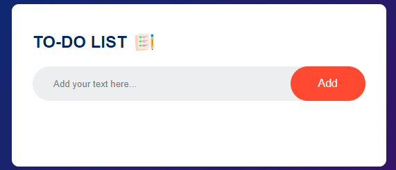

<!-- Add your project title -->
<p align="center">
  
</p>

<h1 align="center">TODO List Web App</h1>

<p align="center">
  A beautiful and intuitive TODO List web app built using HTML, CSS, and JavaScript. Stay organized with style!
</p>

<p align="center">
  
</p>

## ✨ Features

- 📝 Add tasks to your list.
- ✅ Mark tasks as completed.
- 🗑️ Delete tasks from your list.
- 🌐 Responsive and visually appealing design.
- 📦 Automatically saves your tasks in the browser's local storage.

## 🚀 Demo


## 📸 Screenshots


## 🛠️ Installation

1. Clone the repository:

   ```bash
   git clone https://github.com/your-username/todo-list.git
